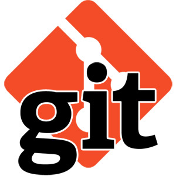
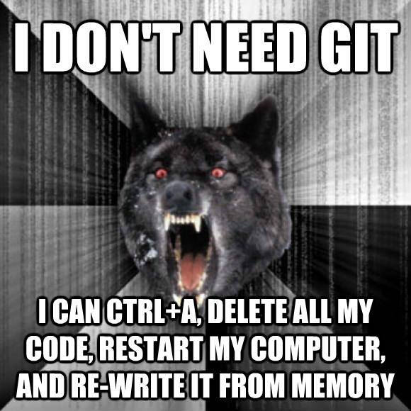

# Initiation à git

## C'est quoi "git"?

Git est une outil de gestion version.   
**Une gestion de version?**  
Pour commencer parlons des gestionnaires de versions (ou VCS en anglais, pour Version Control System), l’idée semble simple au premier abord : avoir un système permettant d’enregistrer l’ensemble des fichiers d’un projet, comme des ‘back-up’ (fichiers de secours), que l’on pourrait sauvegarder les uns après les autres comme des versions de notre projet.  

L’ensemble des sauvegardes d’un projet (dit versionné) est appelé dépôt (ou repository). Retenez bien le jargon car cela vous aidera afin de comprendre cet article mais aussi toute documentation que vous pourrez lire.

***

## Sahalan'ny ahoana ny fiasan'ny git?  
### 1. Misy ny coté client  
Ato no miasa ianao
### 2. Misy ny coté serveur
Ato no misy ireo versions rehetra  

***

Vous allez ainsi utiliser votre logiciel de gestion de versions (côté client) avec principalement les actions suivantes :

    - Récupérer le(s) fichier(s) : **checkout**  
    - Envoyer une nouvelle version : **commit** (normalement accompagné d’un message)
    - Récupérer la dernière version : **update**  
    - Voir l’état de vos fichiers par rapport à la dernière version : **status**  
    - Voir l’historique des versions : **log**  
    - Comparer 2 versions : **diff**    

***

## Fomba fiasa matetika  

Avant d’avancer plus spécifiquement sur git voyons un cycle de travail classique d’une personne sur un projet (avec un système de version simple).

Dans cet exemple les choses sont très simples mais si vous travaillez en équipe, un problème va apparaître : si le même fichier est modifié par 2 personnes différentes, comment mettre à jour le dépôt? La solution est la fusion (ou merge en anglais), la première personne à envoyer (commit) sa version n’aura pas de soucis mais la deuxième devra d’abord récupérer cette nouvelle version et la fusionner avant de pouvoir ‘commit’.

***

## La décentralisation

La décentralisation est un concept assez simple, chaque client devient aussi un serveur indépendant. Votre dépôt habituel peut être considéré comme un simple client.

Ainsi, chaque client (ordinateur) possède son propre **dépôt** (**repository**), dit local. Un commit n’envoie donc plus sur un dépôt central mais sur le local.

Une nouvelle commande fait son apparition : **push**, celle-ci permet d’envoyer le(s) versions contenues dans le dépôt local vers un distant (dit **remote**). Vous pouvez voir cette opération comme une synchronisation (dans un sens seulement).

Aussi, l’équivalent de la commande **update** sera **pull** (en opposition à **push**) afin de récupérer les informations du dépôt distant dans votre dépôt local (les fichiers sont mis à jour par la même occasion).

Afin de gérer ces dépôts distants, git possède plusieurs sous-commandes depuis la commande remote, parmi lesquels:

    - git remote : affiche la liste des dépôts enregistrés (simplement les nom)
    - git remote -v : affiche la liste des dépôts enregistrés (nom et adresse)
    - git remote add <nom du dépôt> <adresse du dépôt> : ajoute un nouveau dépôt
    - git remote remove <nom du dépôt> : supprime un dépôt

***

## Les branches

Ce concept existait en fait
sur les anciens systèmes
aussi mais restait très
rudimentaire. Une branche
est une sorte de sous-dépôt,
elle peut aussi commencer
depuis une version
particulière et se terminer.
Au sein d’un dépôt, vous
allez donc pouvoir commit
sur une branche en
particulier, par défaut, la
branche principale est
master.

Afin de gérer les branches
vous utiliserez le plus
souvent les commandes
suivantes :  

	- **git branch** : créer une nouvelle branche
	- **git checkout** : change de branche (oui c’est comme récupérer un dépôt en fait)
	- **git merge** : fusionne une branche vers la branche courante  

Vous comprendrez que ce
système de branche permet
à plusieurs personnes de
travailler sur le même projet
sans créer de conflits. Une
fois les travaux terminés, les
branches peuvent être
fusionnées par la suite. De
même, vous pouvez
imaginer un système de
branches hiérarchisées. En
fait, la souplesse induite par
ce système permet
beaucoup de possibilités et
la difficulté principale sera
pour vous de trouver une
structure adaptée à votre
projet et à votre équipe.

